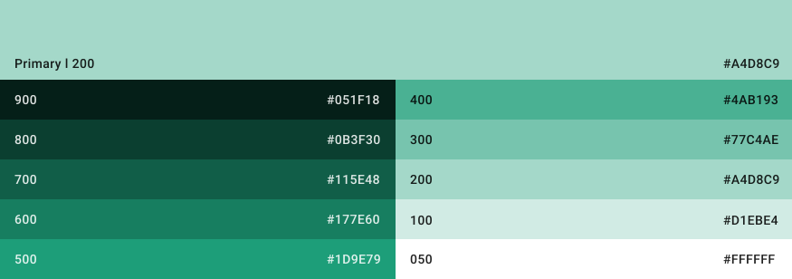
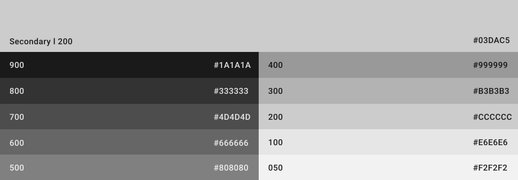

# Colors

## Color Scheme

General color scheme reused across the entire application

> Since these are exports from figma where we work with a light theme approach
> please make sure to invert the colors accordingly (so always use light text on dark background etc.)

{: style="width:80%;margin:auto;display:block;"}

## Primary

### Color and shadings

### Emphasis

## Secondary

### Color and shadings

### Emphasis

## Outlines (borders)

{: style="background:var(--md-code-bg-color);padding:10px;"}
